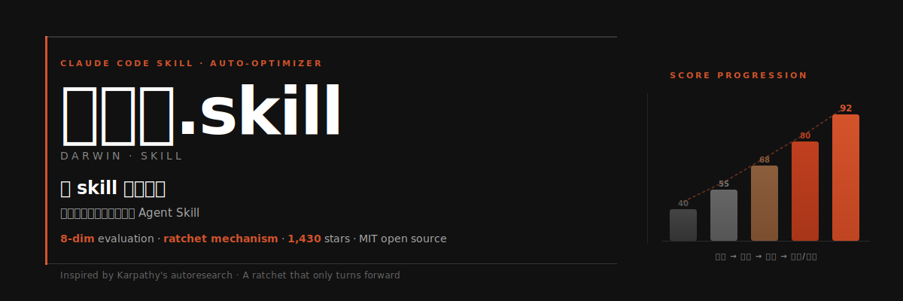
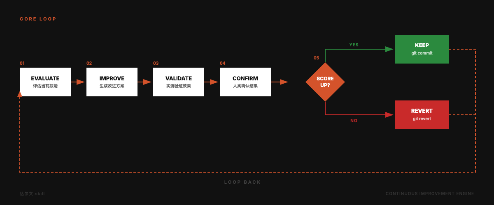
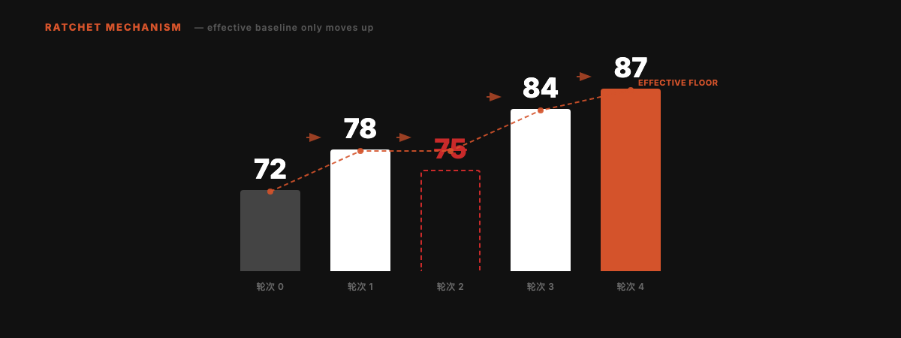

<div align="right">

**[English](README_EN.md)** | 中文

</div>



<p align="center">
  
  <br/>
  <sub>动画由 <a href="https://github.com/alchaincyf/huashu-design">huashu-design</a> skill 制作</sub>
</p>

<div align="center">

# 达尔文.skill

**像训练模型一样优化你的 Agent Skills。**

受 [Andrej Karpathy 的 autoresearch](https://github.com/karpathy/autoresearch) 启发，将自主实验循环从模型训练搬到 Skill 优化领域。一个只能向前转的棘轮。

[](LICENSE)
[](https://skills.sh)
[](https://skills.sh)

```
npx skills add alchaincyf/darwin-skill
```

</div>

---

## 核心循环



---

## 为什么做这个

Agent Skill 生态在快速扩张。Claude Code、Codex、OpenClaw、Trae、CodeBuddy 等工具都支持 SKILL.md 格式。当你有 10 个 Skills 时可以手动维护；当你有 60+ 个 Skills 时，你需要一个系统。

传统的 Skill 审查是**纯结构性的**：检查格式对不对、步骤有没有编号、路径能不能访问。但一个格式完美的 Skill，跑出来的效果可能很差。

达尔文.skill 同时评估**结构质量**和**实际效果**，然后只保留真正有改进的修改。

---

## 从 autoresearch 到 Skill Optimizer

这个项目直接受 Karpathy autoresearch 启发。autoresearch 的做法是：写一个 `program.md` 定义目标和约束，让 agent 自主生成和测试代码变更，只保留可测量的改进。

我们把同样的思路搬到了 Skill 优化：

| autoresearch | 达尔文.skill | 为什么这样映射 |
|:---|:---|:---|
| `program.md` | 本 SKILL.md | 定义评估标准和约束规则 |
| `train.py` | 每个待优化的 SKILL.md | 被优化的资产，每次实验只改它 |
| `val_bpb` | 8 维加权总分（满分100） | 可量化的优化目标 |
| `git ratchet` | keep / revert 机制 | 只保留有改进的 commit |
| `test set` | test-prompts.json | 验证改进是否真的有效 |
| 全自主运行 | **人在回路** | Skill 的好坏比 loss 更微妙，需要人的判断 |

---

## 五条核心原则

| # | 原则 | 说明 |
|:---|:---|:---|
| 01 | **单一可编辑资产** | 每次只改一个 SKILL.md，变量可控，改进可归因 |
| 02 | **双重评估** | 结构评分（静态分析）+ 效果验证（跑测试看输出） |
| 03 | **棘轮机制** | 只保留改进，自动回滚退步，分数只升不降 |
| 04 | **独立评分** | 评分用子 agent，避免「自己改自己评」的偏差 |
| 05 | **人在回路** | 每个 Skill 优化完后暂停，用户确认再继续下一个 |

---

## 8 维度评估体系

总分 100。结构维度靠静态分析（60分），效果维度必须实测（40分）。


> 实测表现权重最高（25分）。Skill 写得再漂亮，跑出来效果不好就是零。

---

## 优化循环：5 个阶段

系统在每个阶段内自主运行，但在阶段之间暂停等待人类确认。


**Phase 2 的核心逻辑**：

1. 找出得分最低的维度
2. 针对该维度生成 1 个具体改进方案
3. 编辑 SKILL.md，git commit
4. 子 agent 独立重新评分
5. 新分 > 旧分 → 保留；否则 → git revert
6. 每个 Skill 完成后暂停，展示 diff + 分数变化，等用户确认

---

## 棘轮机制

分数只能上升。每一轮要么改进 Skill，要么干净地回滚。不会随时间积累局部退化。



轮次 2 的 75 分低于当前最优的 78 分，被自动回滚。有效基线始终锁定在 78，后续改进从 78 继续。

---

## 快速开始

```bash
npx skills add alchaincyf/darwin-skill
```

安装后在任何支持 Skill 的 Agent 工具中说「优化所有skills」或「优化某个skill」就行。

无法访问 GitHub 的朋友，可以直接下载 zip 包：[darwin-skill.zip](https://pub-161ae4b5ed0644c4a43b5c6412287e03.r2.dev/skills/darwin-skill.zip)，解压后把 SKILL.md 放到 `~/.claude/skills/darwin-skill/` 目录即可。

---

## 设计灵感

这个项目的设计直接受 **Andrej Karpathy 的 [autoresearch](https://github.com/karpathy/autoresearch)** 启发。

核心机制完全相同：**只保留可测量的改进，其余全部回滚。**

---

## 关于作者

| | |
|:---|:---|
| 🌐 官网 | [bookai.top](https://bookai.top) · [huasheng.ai](https://www.huasheng.ai) |
| 𝕏 Twitter | [@AlchainHust](https://x.com/AlchainHust) |
| 📺 B站 | [花叔](https://space.bilibili.com/14097567) |
| ▶️ YouTube | [@Alchain](https://www.youtube.com/@Alchain) |
| 📕 小红书 | [花叔](https://www.xiaohongshu.com/user/profile/5abc6f17e8ac2b109179dfdf) |
| 💬 公众号 | 微信搜「花叔」 |

---

## 许可证

MIT

---

<div align="center">

**[女娲](https://github.com/alchaincyf/nuwa-skill)** 造 Skill。<br>
**达尔文** 让 Skill 进化。<br><br>
*只保留改进，时间就站在你这边。*

<br>

MIT License © [花叔 Huashu](https://github.com/alchaincyf)

</div>
